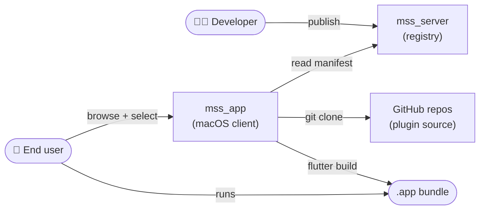
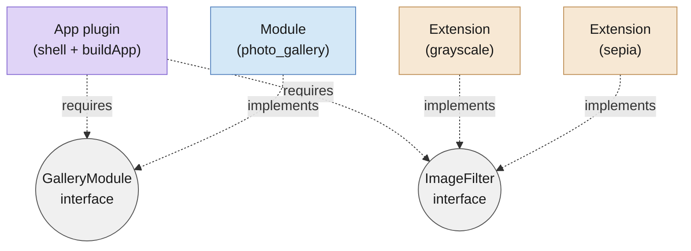

# Memention Software Shop

> *Create, Share and Earn*

MSS is a plugin ecosystem and registry for assembling custom desktop apps from
components other people built. Developers publish pieces — a *photo gallery*
module, a *grayscale filter* extension, a *photo-viewer* app shell — and end
users combine them into a single binary with one click.

The name carries its double meaning on purpose: *shop* as in the storefront
where you browse finished apps, and *shop* as in the workshop where developers
trade working components.

**Live at [mss.memention.net](https://mss.memention.net)** · macOS client
currently; other platforms will follow.

<!-- image: hero
prompt: "A modern minimalist desktop illustration of a split-screen metaphor
— the left half shows a polished macOS window ('Photo Viewer') with a gallery
of photos; the right half shows the same window exploded into four floating
puzzle pieces labelled 'app', 'gallery', 'grayscale', 'sepia' that are being
assembled. Muted purple/navy background echoing the Vitruvian-Man brand art
from the original MSS deck. Flat vector style, subtle gradient, no text other
than the window title and the four labels."
-->

---

## How it works

1. **Developers** publish *plugins* — each points at a git repo + SHA.
2. **End users** pick an *app* plugin plus whichever *modules* and
   *extensions* they want, then hit **Build**.
3. **The client** clones the referenced sources, generates a Flutter project
   (`main.dart`, `pubspec.yaml`, registry wiring), and runs
   `flutter build macos` locally. Out pops an `.app` bundle.

No plugin source ever touches a central build server. Every assembly happens
on the user's own machine from public git — the registry just points.

---

## Plugin types

- **App** — the shell. Wires modules into a running Flutter app, owns the
  top-level UI.
- **Module** — a self-contained feature surface (photo gallery, score
  HUD, settings pane). Apps can have many.
- **Extension** — a small pluggable piece attached to a module or app
  (image filters, physics rules, asset packs). Apps enumerate them at
  runtime via `.whereType<T>()`.
- **Interface** — the contract between plugins. Apps declare what they
  require; modules/extensions declare what they implement. The registry
  uses this for typecheck-at-build-time and for the picker UI.

The full contract lives in
[`mss_core`](https://github.com/flutter-mss/mss_core) — six tiny Dart files,
one abstract class each.

---

## Repo map

| Repo | What it is |
|---|---|
| **[mss_core](https://github.com/flutter-mss/mss_core)** | Plugin contract (Dart). Interfaces every plugin implements against. Versioned semver. |
| **[mss_server](https://github.com/flutter-mss/mss_server)** | FastAPI + SQLite registry. Auth, plugin/interface catalog, asset hosting. |
| **[mss_app](https://github.com/flutter-mss/mss_app)** | macOS Flutter client. Browse, pick, assemble, build. *(private; builds distributed via `mss_releases`)* |
| **[mss_releases](https://github.com/flutter-mss/mss_releases)** | Download channel — signed + notarized `MSS.app` zips attached to each version tag. |
| **[demo_photoapp](https://github.com/flutter-mss/demo_photoapp)** | Reference bundle — seven-package photo viewer (1 app + 1 module + 2 extensions + 3 defs). |
| **[demo_flappybird](https://github.com/flutter-mss/demo_flappybird)** | Reference bundle — playable game with swappable physics + asset-pack extensions. |
| **[demo_alternative_physics](https://github.com/flutter-mss/demo_alternative_physics)** | Single-package extension demonstrating the non-subpath case. |

---

## Download

Grab the latest signed + notarized macOS build:

→ [**Download MSS for macOS**](https://github.com/flutter-mss/mss_releases/releases/latest)
 · [all releases](https://github.com/flutter-mss/mss_releases/releases)

Unzip, drag `MSS.app` to `/Applications`, launch. You'll also need Flutter
and the Xcode Command Line Tools installed — the app shells out to
`flutter build macos` when assembling plugins into a runnable binary.

Browsing the registry is anonymous. Publishing plugins requires an account
(register through the app; confirmation mail is sent via Mailjet).

<!-- image: app-screenshot
prompt: "Screenshot mockup of a macOS app store window titled 'Memention
Software Shop'. A grid of 6 plugin cards each showing a coloured icon, a
name like 'Photo Viewer', 'Flappy Bird', 'Alternative Physics', and a short
tagline. Left sidebar shows categories ('Games', 'Photography', 'Utilities',
'Developer Tools'). Bottom-right a prominent 'Build' button. macOS Sonoma
window chrome, light mode, subtle drop shadows. No real user data."
-->

---

## Author a plugin

Start with a `pubspec.yaml` that depends on `mss_core`, subclass one of
`AppInterface` / `ModuleInterface` / `ExtensionInterface`, push to GitHub,
and register it through the client's *Publish* flow.

→ [**Plugin author guide**](https://github.com/flutter-mss/mss_core#plugin-author-guide)
(in `mss_core/README.md`)

The demo repos above are the canonical working references — keep one open in
a split window while building your first plugin.

---

## Status

- **Architecture frozen** — core contracts are versioned (`mss_core`
  follows semver; current pre-release).
- **Public** — registry open for anyone to browse; free to publish.
- **macOS-first** — pipeline currently targets `flutter build macos`. Other
  targets are mechanical but not wired yet.
- **Open source** — MIT across every repo.

## Background

The original pitch, circa 2005 — *Create, Share and Earn*: an internet
service for component-based software where a user pays only for the pieces
they actually need, and developers can focus on the one thing they're
expert at. See the
[original deck](https://github.com/flutter-mss/.github/blob/main/legacy/MSS_pres.pdf).

The modern incarnation trades the "pay once" commerce layer for an
MIT-licensed open exchange, and swaps out the Java/Shockwave delivery of
the original for Flutter + native builds — but the two-sided
developer ↔ user shape is intact.
